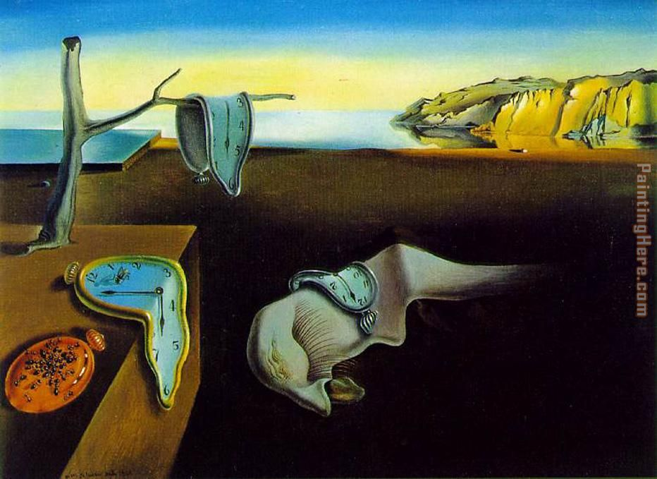
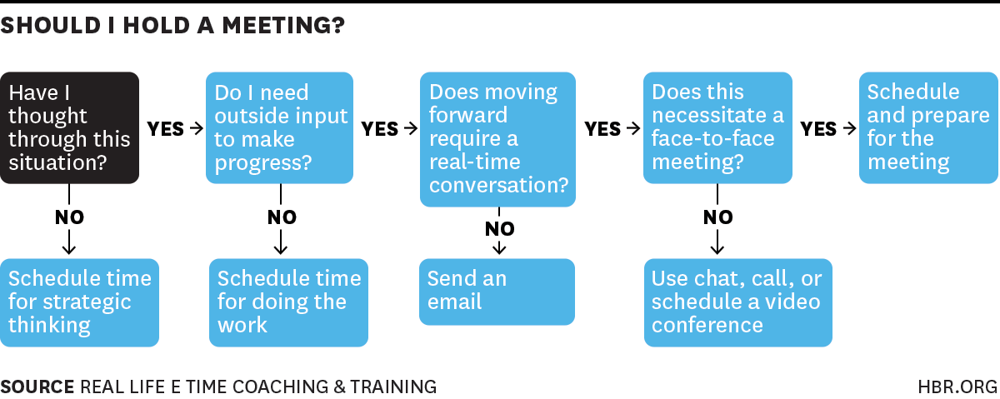
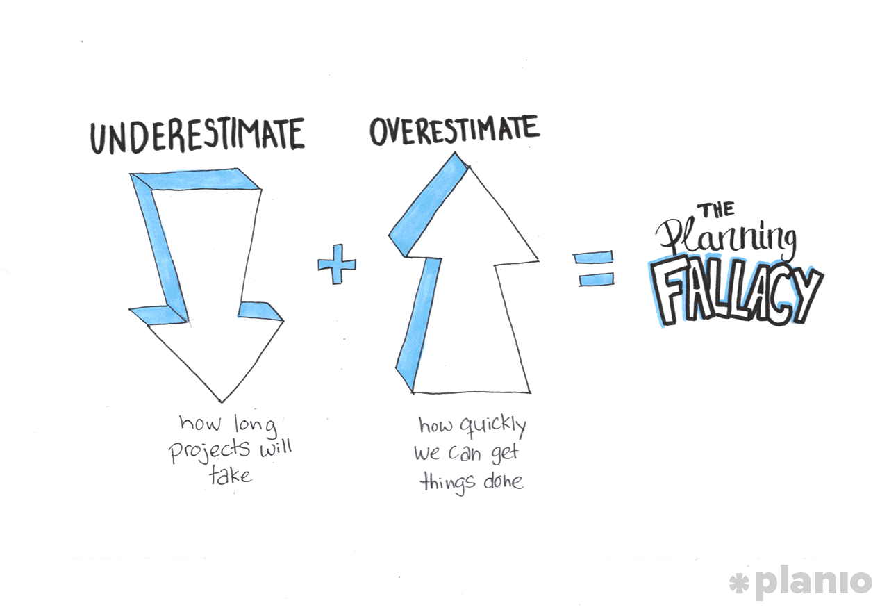

```{r setup, include=FALSE}
knitr::opts_chunk$set(echo = TRUE)
```


## Why did your employer hire you?


Not because of this

<aside class="notes">
 - They hired you because they have problems that they think you can solve
 - When you get hired you realize that the biggest problems are the ones they couldn't even recognize!
</aside>

## How do get better at solving problems?

   $$Effort * Time = Productivity$$

<aside class ="notes">
 - This is the only LaTeX in this presentation
 - This comes from Deep Work
 - Think about how long you were able to work on a project without losing focus
 - Your goal should be maximize that amount of time
</aside>


## Optimizing for Time



 1. Track
 2. Remove
 3. Automate

<aside class = "notes">
 - First, start tracking your time (I use 30 minute increments)
 - Remove everything from your phone that distracts you (even your work Slack)
 - Automate whatever you can
</aside> 

## The Pomodoro Method

 1. Work on one thing for 25 minutes.
 2. Rest for 5 minutes.
 3. Repeat 4 times.
 4. Take a longer break.

## What should I automate?


<aside class = "notes">
 - Think about the tasks you do when you had a bad night's rest (low effort)
 - Bonus points if it's something that a lot of your co-workers complain about
</aside>

## What about meetings?



<aside class = "notes">
 - If you are invited to a meeting, ask for an agenda. Come prepared and arrive on time.
 - Try to minimize the number of people in meetings to just stakeholders
 - If someone is checking their emails for most of the meeting, then the meeting should have been an email
</aside>


## Optimizing for Effort

 1. Sleep
 2. Diet
 3. Exercise

<aside class="note">
 - If you aren't sleeping, eating well or exercising regularly, you won't have much energy
 - Trying to push yourself without taking of your yourself
 - Know when to stop for the day without feeling guilty about it (For me it's 5 hours of deep work or 6pm)
 - I used to be very bad at this in university
</aside>

## Am I putting my effort into the right project?

   1. Is there some off-the-shelf product that would cost less than developing something in house?
   2. How will I know if a project isn't working?
   3. What are the maintainance costs after I finish this project?

## Planning




<aside class="note">
 - Humans are very bad it this
 - Hope you've been tracking your time!
 - My rule of thumb: break a project into small tasks (should take 2 to 4 hours to complete) then double your gut feeling on tasks you haven't tracked before
</aside>

## Common Data Science Project Pitfalls

 - You don't have the data to answer the question
 - You spent too much time polishing a model of little value
 - Bugs in data science projects are hard to find and squash


## Leave Time to Learn

 - I take at least an hour a day to learn something new
 - You are investing in your future

## Suggested Reading

 - The Personal MBA by Josh Kaufman
 - Soft Skill by John Sonmez
 - The Manager's Path by Camille Fournier

## Thesis 